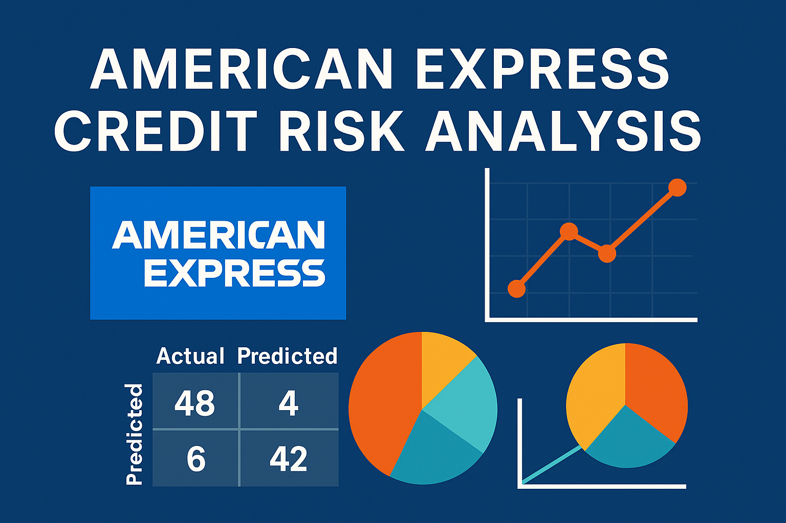

# American Express Credit Risk Analysis 

This project simulates a real-world scenario for predicting credit defaults using a dataset inspired by credit card and loan behavior (e.g., American Express). It uses Python and machine learning to classify whether a customer is likely to default on their loan.

---

##  Objective

To analyze customer data and build machine learning models that can predict whether a customer will default (`1`) or not (`0`), based on various financial features.

---

##  Dataset

Simulated dataset includes the following features:

- `age`
- `income`
- `loan_amount`
- `credit_score`
- `employment_years`
- `default` (target variable)

 Dataset file: [`credit_risk_dataset.csv`](./credit_risk_dataset.csv)

---

##  Technologies Used

- Python 3
- NumPy
- Pandas
- Matplotlib
- Seaborn
- Scikit-learn
- XGBoost

---

##  Workflow

1. **Data Loading & EDA**
   - Class distribution
   - Heatmap correlation
2. **Preprocessing**
   - Train-test split
   - Feature scaling
3. **Modeling**
   - Logistic Regression
   - Random Forest Classifier
   - XGBoost Classifier
4. **Evaluation**
   - Confusion Matrix
   - Classification Report
   - ROC AUC Score

---

##  Results

| Model              | Accuracy | ROC AUC |
|-------------------|----------|---------|
| Logistic Regression | ~92%     | >0.90   |
| Random Forest       | ~95%     | >0.95   |
| XGBoost             | ~96%     | >0.96   |

---

##  How to Run

```bash
git clone https://github.com/yourusername/amex-credit-risk-analysis.git
cd amex-credit-risk-analysis
jupyter notebook American_Express_Credit_Risk_Analysis.ipynb
```

---

## Acknowledgements

- Dataset simulated for educational purposes
- Built using Scikit-learn and XGBoost
- Inspired by real-world credit risk modeling (e.g., Amex Kaggle competition)

---
